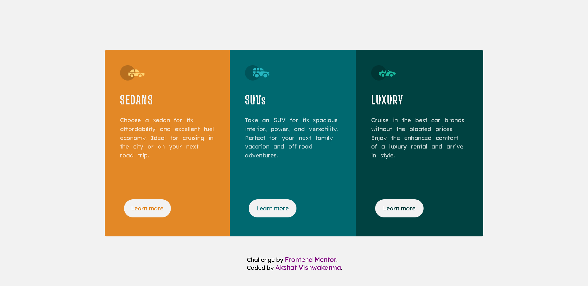

# Frontend Mentor - 3-column preview card component solution

This is a solution to the [3-column preview card component challenge on Frontend Mentor](https://www.frontendmentor.io/challenges/3column-preview-card-component-pH92eAR2-). Frontend Mentor challenges help you improve your coding skills by building realistic projects.

## Table of contents

- [Overview](#overview)

  - [The challenge](#the-challenge)
  - [Screenshot](#screenshot)

- [My process](#my-process)
  - [Built with](#built-with)
  - [What I learned](#what-i-learned)
  - [Continued development](#continued-development)

## Overview

### The challenge

Users should be able to:

- View the optimal layout depending on their device's screen size
- See hover states for interactive elements

### Screenshot

- For desktop view
  

- For mobile view
  

## My process

### Built with

- Semantic HTML5 markup
- CSS custom properties
- Flexbox
- Desktop-first workflow

### What I learned

This was my first project. I'm just a beginner in this world of coding. Doing this project and completing it the very first try was a achivement for me.

The thing that I learned while doing this project was to align things on the center. Centering things was task for me. I got just what I hoped for i.e. learning new skills and practising that I already know.

### Continued development

After this project, I would be looking for something that challenges my skills with images. Dealing with images has been quite confusing for me and that'a what the next thing that I would be focusing on.
